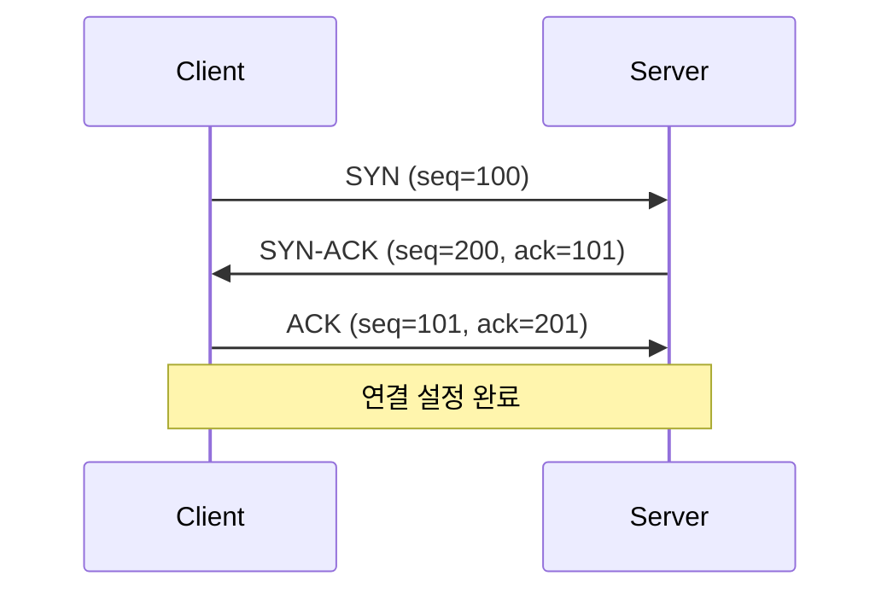

# TCP/IP 모델

## 개요
TCP/IP 모델은 실제 인터넷에서 사용되는 4계층 프로토콜 스택입니다. [[OSI 7계층 모델]]의 실용적 구현체로 볼 수 있습니다.

## 4계층 구조

| TCP/IP 계층 | OSI 대응 계층 | 주요 프로토콜 | 기능 |
|-------------|---------------|---------------|------|
| **Application** | Application, Presentation, Session | HTTP, FTP, SMTP, DNS | 애플리케이션 서비스 |
| **Transport** | Transport | [[TCP]], [[UDP]] | 종단간 통신 |
| **Internet** | Network | [[IP]], ICMP, [[ARP]] | 패킷 라우팅 |
| **Network Access** | Data Link, Physical | [[Ethernet]], WiFi | 물리적 전송 |

## 계층별 상세

### Application Layer (응용 계층)
**역할**: 사용자와 네트워크 간 인터페이스 제공

**주요 프로토콜**:
- **HTTP/HTTPS**: 웹 브라우징 (포트 80/443)
- **FTP**: 파일 전송 (포트 20/21)
- **SMTP**: 이메일 전송 (포트 25)
- **DNS**: 도메인 이름 해석 (포트 53)
- **DHCP**: 자동 IP 할당 (포트 67/68)
- **SNMP**: 네트워크 관리 (포트 161/162)

### Transport Layer (전송 계층)
**역할**: 종단 간 신뢰성 있는 데이터 전송

#### TCP (Transmission Control Protocol)
```
특징:
✅ 연결 지향적 (Connection-oriented)
✅ 신뢰성 보장 (Reliable)
✅ 흐름 제어 (Flow Control)
✅ 오류 복구 (Error Recovery)
❌ 오버헤드 큼

사용처: 웹, 이메일, 파일 전송
```

#### UDP (User Datagram Protocol)
```
특징:
✅ 비연결 지향적 (Connectionless)
✅ 빠른 전송 (Fast)
✅ 낮은 오버헤드 (Low Overhead)
❌ 신뢰성 보장 안함

사용처: DNS, DHCP, 스트리밍
```

### Internet Layer (인터넷 계층)
**역할**: 패킷 라우팅 및 주소 지정

#### IPv4 주소 체계
```
클래스별 구분:
Class A: 1.0.0.0   ~ 126.0.0.0   (/8)
Class B: 128.0.0.0 ~ 191.255.0.0 (/16)  
Class C: 192.0.0.0 ~ 223.255.255.0 (/24)

사설 IP 대역:
10.0.0.0/8        (Class A)
172.16.0.0/12     (Class B)
192.168.0.0/16    (Class C)
```

#### 주요 프로토콜
- **IP**: 패킷 라우팅 및 주소 지정
- **ICMP**: 오류 메시지 및 제어 (ping, traceroute)
- **ARP**: IP 주소를 MAC 주소로 변환
- **RARP**: MAC 주소를 IP 주소로 변환

### Network Access Layer (네트워크 접근 계층)
**역할**: 물리적 네트워크 접근

#### 이더넷
```
표준: IEEE 802.3
주소: MAC 주소 (48비트)
프레임 구조:
[Preamble|Dest MAC|Src MAC|Type|Data|FCS]
```

#### WiFi
```
표준: IEEE 802.11
주파수: 2.4GHz, 5GHz
보안: WPA2, WPA3
```

## 캡슐화와 역캡슐화

### 송신 과정 (캡슐화)
```
Application Data
        ↓
[TCP/UDP Header | Data] ← Transport Layer
        ↓
[IP Header | TCP Segment] ← Internet Layer  
        ↓
[Ethernet Header | IP Packet | Trailer] ← Network Access
        ↓
Physical Bits
```

### 수신 과정 (역캡슐화)
```
Physical Bits
        ↓
[Ethernet Header | IP Packet | Trailer] → Frame 분석
        ↓
[IP Header | TCP Segment] → IP 헤더 분석
        ↓
[TCP/UDP Header | Data] → 포트 확인
        ↓
Application Data → 애플리케이션 전달
```

## TCP 3-Way Handshake



1. **SYN**: 클라이언트가 연결 요청
2. **SYN-ACK**: 서버가 연결 수락 및 요청
3. **ACK**: 클라이언트가 연결 확인

## 포트 번호

### Well-Known Ports (0-1023)
| 포트 | 프로토콜 | 서비스 |
|------|----------|--------|
| 20/21 | FTP | 파일 전송 |
| 22 | SSH | 보안 원격 접속 |
| 23 | Telnet | 원격 접속 |
| 25 | SMTP | 이메일 전송 |
| 53 | DNS | 도메인 이름 해석 |
| 67/68 | DHCP | IP 자동 할당 |
| 80 | HTTP | 웹 서비스 |
| 110 | POP3 | 이메일 수신 |
| 143 | IMAP | 이메일 수신 |
| 443 | HTTPS | 보안 웹 서비스 |
| 161/162 | SNMP | 네트워크 관리 |

### Registered Ports (1024-49151)
- 애플리케이션별 등록된 포트
- 예: 3389 (RDP), 1521 (Oracle)

### Dynamic Ports (49152-65535)
- 클라이언트가 임시로 사용하는 포트

## IPv4 헤더 구조

```
 0                   1                   2                   3
 0 1 2 3 4 5 6 7 8 9 0 1 2 3 4 5 6 7 8 9 0 1 2 3 4 5 6 7 8 9 0 1
+-+-+-+-+-+-+-+-+-+-+-+-+-+-+-+-+-+-+-+-+-+-+-+-+-+-+-+-+-+-+-+-+
|Version|  IHL  |Type of Service|          Total Length         |
+-+-+-+-+-+-+-+-+-+-+-+-+-+-+-+-+-+-+-+-+-+-+-+-+-+-+-+-+-+-+-+-+
|         Identification        |Flags|      Fragment Offset    |
+-+-+-+-+-+-+-+-+-+-+-+-+-+-+-+-+-+-+-+-+-+-+-+-+-+-+-+-+-+-+-+-+
|  Time to Live |    Protocol   |         Header Checksum       |
+-+-+-+-+-+-+-+-+-+-+-+-+-+-+-+-+-+-+-+-+-+-+-+-+-+-+-+-+-+-+-+-+
|                       Source Address                          |
+-+-+-+-+-+-+-+-+-+-+-+-+-+-+-+-+-+-+-+-+-+-+-+-+-+-+-+-+-+-+-+-+
|                    Destination Address                        |
+-+-+-+-+-+-+-+-+-+-+-+-+-+-+-+-+-+-+-+-+-+-+-+-+-+-+-+-+-+-+-+-+
```

### 주요 필드
- **Version**: IP 버전 (4 또는 6)
- **TTL**: 홉 수 제한 (라우터마다 -1)
- **Protocol**: 상위 프로토콜 (TCP=6, UDP=17, ICMP=1)
- **Source/Destination Address**: 출발지/목적지 IP

## 서브네팅

### CIDR (Classless Inter-Domain Routing)
```
표기법: 192.168.1.0/24
/24 = 255.255.255.0 = 24비트 네트워크 부분

서브넷 계산:
192.168.1.0/24 → 256개 호스트 (실제 254개)
192.168.1.0/25 → 128개 호스트 (실제 126개)
192.168.1.0/26 → 64개 호스트 (실제 62개)
```

### VLSM (Variable Length Subnet Mask)
- 필요에 따라 다양한 크기의 서브넷 생성
- IP 주소 효율적 사용

## 실습 명령어

### Linux/Unix
```bash
# IP 설정 확인
ip addr show
ifconfig

# 라우팅 테이블
ip route show
route -n

# 연결성 테스트
ping 8.8.8.8
traceroute google.com

# 포트 상태
netstat -tuln
ss -tuln
```

### Windows
```cmd
# IP 설정 확인
ipconfig /all

# 라우팅 테이블
route print

# 연결성 테스트
ping 8.8.8.8
tracert google.com

# 포트 상태
netstat -an
```

## 문제해결 시나리오

### 연결 안됨 문제
1. **Physical**: 케이블, LED 확인
2. **Network Access**: IP 주소, 서브넷 마스크 확인
3. **Internet**: 기본 게이트웨이, DNS 확인
4. **Transport**: 포트, 방화벽 확인
5. **Application**: 서비스 상태 확인

### 성능 문제
- 대역폭 사용률 모니터링
- 지연시간 측정 (ping)
- 패킷 손실률 확인
- QoS 정책 점검

## 관련 주제
- [[OSI 7계층 모델]] - 참조 모델과의 비교
- [[서브네팅]] - IP 주소 분할
- [[라우팅 기초]] - 패킷 포워딩
- [[NAT-PAT]] - 주소 변환

## 태그
#ccna #tcp-ip #프로토콜 #인터넷 #네트워킹기초
