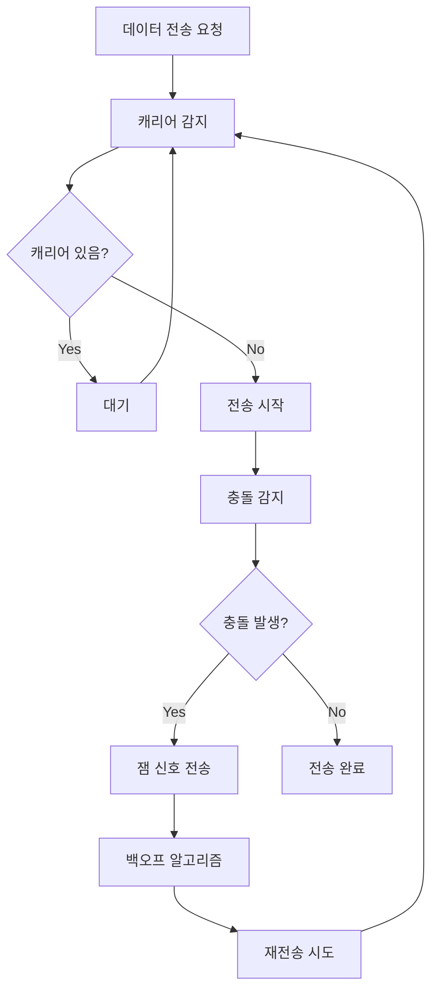

# 이더넷 기초

## 개요
이더넷(Ethernet)은 가장 널리 사용되는 LAN 기술로, IEEE 802.3 표준을 기반으로 합니다. [[OSI 7계층 모델]]의 1-2계층에서 동작합니다.

## 이더넷 표준 발전

### 속도별 분류
| 표준 | 속도 | 매체 | 최대 거리 | 년도 |
|------|------|------|-----------|------|
| 10BASE-T | 10 Mbps | UTP Cat3 | 100m | 1990 |
| 100BASE-TX | 100 Mbps | UTP Cat5 | 100m | 1995 |
| 1000BASE-T | 1 Gbps | UTP Cat5e | 100m | 1999 |
| 10GBASE-T | 10 Gbps | UTP Cat6a | 100m | 2006 |
| 25GBASE-T | 25 Gbps | UTP Cat8 | 30m | 2016 |
| 40GBASE-T | 40 Gbps | UTP Cat8 | 30m | 2016 |

### 표준 명명 규칙
```
10BASE-T 분석:
10    = 속도 (10 Mbps)
BASE  = 베이스밴드 (디지털 신호)
T     = 매체 (Twisted Pair)

기타 매체 표기:
T  = Twisted Pair (UTP/STP)
F  = Fiber Optic
C  = Coaxial Cable
```

## CSMA/CD (Carrier Sense Multiple Access/Collision Detection)

### 동작 원리
1. **Carrier Sense**: 전송 전 캐리어 감지
2. **Multiple Access**: 여러 노드가 매체 공유
3. **Collision Detection**: 충돌 감지 시 재전송



### 백오프 알고리즘
```
재전송 시간 = Random(0, 2^n) × 슬롯 타임

n: 충돌 횟수 (최대 10)
슬롯 타임: 512 비트 시간

예시:
1번째 충돌: 0-1 슬롯 중 랜덤
2번째 충돌: 0-3 슬롯 중 랜덤  
3번째 충돌: 0-7 슬롯 중 랜덤
```

## 이더넷 프레임 구조

### IEEE 802.3 프레임
```
┌──────────┬─────────┬─────────┬──────┬─────────┬─────┐
│ Preamble │   SFD   │Dest MAC │ Src  │ Length/ │Data │
│  7 bytes │ 1 byte  │ 6 bytes │ MAC  │  Type   │     │
│          │         │         │6bytes│ 2 bytes │     │
└──────────┴─────────┴─────────┴──────┴─────────┴─────┘
                                                │     │
┌─────────────────────────────────────────────────────┘     │
│                                                     ┌─────┘
│                                                     │ FCS │
│                                                     │4byte│
└─────────────────────────────────────────────────────┴─────┘
```

### 필드 설명
- **Preamble**: 동기화를 위한 패턴 (10101010...)
- **SFD**: Start Frame Delimiter (10101011)
- **Destination MAC**: 목적지 MAC 주소
- **Source MAC**: 출발지 MAC 주소
- **Length/Type**: 
  - ≤ 1500: 데이터 길이
  - ≥ 1536: 상위 프로토콜 타입
- **Data**: 실제 데이터 (46-1500 bytes)
- **FCS**: Frame Check Sequence (CRC-32)

### 프레임 크기 제한
```
최소 프레임: 64 bytes (헤더 18 + 데이터 46)
최대 프레임: 1518 bytes (헤더 18 + 데이터 1500)

Jumbo Frame: 9000 bytes (비표준, 특수 용도)
```

## MAC 주소 (Media Access Control)

### 구조
```
AA:BB:CC:DD:EE:FF (48비트)
│     │     │
│     │     └─ NIC (Network Interface Card) 고유 번호
│     └─────── 제조사별 할당 번호
└───────────── OUI (Organizationally Unique Identifier)

예시:
00:1B:44:11:3A:B7
└─────┘
  OUI (Intel)
```

### 특수 MAC 주소
```
브로드캐스트: FF:FF:FF:FF:FF:FF
멀티캐스트:   01:xx:xx:xx:xx:xx (LSB=1)
유니캐스트:   00:xx:xx:xx:xx:xx (LSB=0)

Local/Global bit (2번째 bit):
0 = 전역적으로 고유 (제조사 할당)
1 = 로컬 관리 (사용자 설정)
```

## Half-Duplex vs Full-Duplex

### Half-Duplex
```
특징:
- 동시에 송신과 수신 불가
- CSMA/CD 사용
- 허브 환경에서 사용
- 충돌 도메인 공유

대역폭: 공유 (10Mbps를 모든 노드가 공유)
```

### Full-Duplex
```
특징:
- 동시 송신과 수신 가능
- CSMA/CD 불필요
- 스위치 환경에서 사용
- 충돌 없음

대역폭: 전용 (각 포트별 독립적)
```

## 오토네고시에이션 (Auto-Negotiation)

### 협상 과정
1. **FLP (Fast Link Pulse)** 신호 교환
2. 양쪽 장비의 능력 확인
3. 최고 공통 성능으로 설정

### 우선순위 (높은 순서)
1. 1000BASE-T Full-Duplex
2. 1000BASE-T Half-Duplex
3. 100BASE-TX Full-Duplex
4. 100BASE-T4
5. 100BASE-TX Half-Duplex
6. 10BASE-T Full-Duplex
7. 10BASE-T Half-Duplex

### 설정 명령어 (Cisco)
```cisco
# 오토네고시에이션 활성화 (기본값)
Switch(config-if)# speed auto
Switch(config-if)# duplex auto

# 수동 설정
Switch(config-if)# speed 100
Switch(config-if)# duplex full

# 상태 확인
Switch# show interfaces fastethernet 0/1
```

## 충돌 도메인 vs 브로드캐스트 도메인

### 충돌 도메인 (Collision Domain)
```
정의: 충돌이 발생할 수 있는 네트워크 영역

허브 환경:
[PC1]─┐
      ├─[Hub]─[PC3]  ← 모두 하나의 충돌 도메인
[PC2]─┘

스위치 환경:
[PC1]─[Port1]
             [Switch]
[PC2]─[Port2]
             
각 포트별로 별도의 충돌 도메인
```

### 브로드캐스트 도메인 (Broadcast Domain)
```
정의: 브로드캐스트 프레임이 전달되는 영역

스위치 환경:
[PC1]─┐
      ├─[Switch]─[PC3]  ← 모두 하나의 브로드캐스트 도메인
[PC2]─┘

라우터로 분리:
[PC1]─[Switch]─[Router]─[Switch]─[PC2]
      └─ 도메인1 ─┘     └─ 도메인2 ─┘
```

## 이더넷 오류 및 모니터링

### 일반적인 오류
```
Collision: 충돌 발생 (Half-duplex 환경)
Late Collision: 늦은 충돌 (케이블 길이 초과)
CRC Error: 프레임 체크섬 오류
Runt: 최소 길이 미달 프레임 (<64 bytes)
Giant: 최대 길이 초과 프레임 (>1518 bytes)
```

### 모니터링 명령어
```cisco
# 인터페이스 통계
Switch# show interfaces fastethernet 0/1

# 오류 통계만 표시
Switch# show interfaces fastethernet 0/1 | include error

# 카운터 초기화
Switch# clear counters fastethernet 0/1
```

## 케이블링

### UTP 카테고리
| 카테고리 | 최대 속도 | 주파수 | 거리 |
|----------|-----------|--------|------|
| Cat3 | 10 Mbps | 16 MHz | 100m |
| Cat5 | 100 Mbps | 100 MHz | 100m |
| Cat5e | 1 Gbps | 100 MHz | 100m |
| Cat6 | 10 Gbps | 250 MHz | 55m |
| Cat6a | 10 Gbps | 500 MHz | 100m |
| Cat7 | 10 Gbps | 600 MHz | 100m |
| Cat8 | 40 Gbps | 2000 MHz | 30m |

### 케이블 타입
```
Straight-through (직결):
PC ↔ Switch/Hub
Router ↔ Switch/Hub

Crossover (교차):
PC ↔ PC
Switch ↔ Switch
Router ↔ Router

Auto-MDIX 기능으로 최근에는 자동 감지
```

## 실습 시나리오

### 기본 스위치 설정
```cisco
# 호스트명 설정
Switch> enable
Switch# configure terminal
Switch(config)# hostname SW1

# 인터페이스 설정
SW1(config)# interface fastethernet 0/1
SW1(config-if)# description "PC1 Connection"
SW1(config-if)# speed 100
SW1(config-if)# duplex full
SW1(config-if)# no shutdown

# 상태 확인
SW1# show interfaces status
SW1# show mac address-table
```

### 문제해결 예시
```cisco
# 연결 문제 진단
SW1# show interfaces fastethernet 0/1
- Link status: up/down
- Protocol status: up/down
- Duplex: Half/Full
- Speed: 10/100/1000

# 케이블 문제 확인
SW1# show interfaces fastethernet 0/1 | include CRC
SW1# show interfaces fastethernet 0/1 | include collision
```

## 성능 최적화

### 권장사항
1. **Full-Duplex 사용**: 충돌 제거
2. **적절한 케이블**: 속도에 맞는 카테고리
3. **오토네고시에이션**: 최적 성능 자동 선택
4. **오류 모니터링**: 정기적인 상태 점검

### 모범 사례
- 케이블 길이 100m 이하 유지
- 간섭원(형광등, 모터) 피하기
- 정기적인 케이블 테스트
- 적절한 케이블 관리

## 관련 주제
- [[스위치 동작원리]] - 이더넷 기반 스위칭
- [[VLAN 구성]] - 논리적 네트워크 분할
- [[STP]] - 루프 방지 프로토콜
- [[케이블링과 커넥터]] - 물리적 연결

## 태그
#ccna #이더넷 #스위칭 #lan #물리계층
