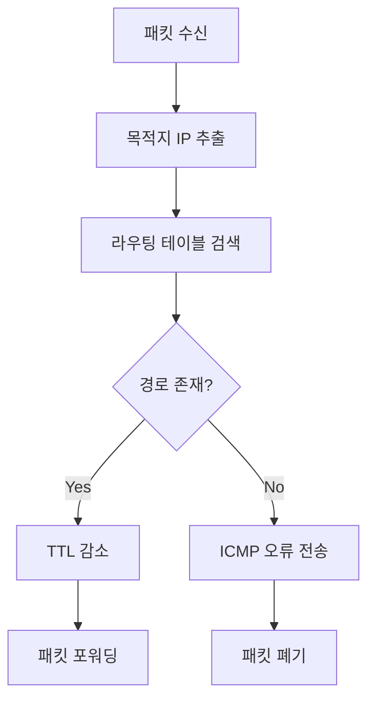

# 라우팅 기초

## 개요
라우팅(Routing)은 서로 다른 네트워크 간에 데이터 패킷을 전달하는 과정입니다. [[OSI 7계층 모델]]의 3계층(Network Layer)에서 동작하며, IP 주소를 기반으로 최적의 경로를 선택합니다.

## 라우팅 vs 스위칭

| 구분 | 라우팅 | 스위칭 |
|------|--------|--------|
| **OSI 계층** | Layer 3 (Network) | Layer 2 (Data Link) |
| **주소 체계** | IP 주소 (논리적) | MAC 주소 (물리적) |
| **데이터 단위** | 패킷 (Packet) | 프레임 (Frame) |
| **도메인 분리** | Broadcast Domain | Collision Domain |
| **주요 기능** | 경로 결정, 패킷 포워딩 | 프레임 스위칭, MAC 학습 |
| **장비** | 라우터, Layer 3 스위치 | 스위치, 브리지 |

## 라우터 동작 원리

### 기본 프로세스
1. **패킷 수신**: 인터페이스를 통해 패킷 받음
2. **목적지 확인**: IP 헤더의 목적지 주소 추출
3. **라우팅 테이블 검색**: 최적 경로 찾기
4. **패킷 포워딩**: 다음 홉으로 전송
5. **TTL 감소**: Time To Live 값 1 감소



### 라우팅 테이블 구성 요소
```
목적지 네트워크 (Destination)
서브넷 마스크 (Subnet Mask)  
다음 홉 (Next Hop)
출구 인터페이스 (Exit Interface)
관리 거리 (Administrative Distance)
메트릭 (Metric)
```

## IP 주소 지정

### IPv4 주소 구조
```
192.168.1.10/24

192.168.1.10 = IP 주소 (32비트)
/24 = 네트워크 비트 수 (CIDR 표기법)

비트 분할:
11000000.10101000.00000001.00001010
└────────────────────────┘└────────┘
       네트워크 부분        호스트 부분
          (24비트)          (8비트)
```

### 클래스별 분류 (Classful)
| 클래스 | 범위 | 기본 마스크 | 네트워크 수 | 호스트 수 |
|--------|------|-------------|-------------|-----------|
| **A** | 1.0.0.0 - 126.0.0.0 | /8 (255.0.0.0) | 126 | 16,777,214 |
| **B** | 128.0.0.0 - 191.255.0.0 | /16 (255.255.0.0) | 16,384 | 65,534 |
| **C** | 192.0.0.0 - 223.255.255.0 | /24 (255.255.255.0) | 2,097,152 | 254 |

### 사설 IP 주소 (RFC 1918)
```
Class A: 10.0.0.0/8        (10.0.0.0 - 10.255.255.255)
Class B: 172.16.0.0/12     (172.16.0.0 - 172.31.255.255)  
Class C: 192.168.0.0/16    (192.168.0.0 - 192.168.255.255)

특수 주소:
127.0.0.0/8    = 루프백 (localhost)
169.254.0.0/16 = APIPA (자동 사설 IP)
224.0.0.0/4    = 멀티캐스트
240.0.0.0/4    = 예약됨
```

## 서브네팅 (Subnetting)

### 기본 개념
```
목적:
- IP 주소 효율적 사용
- 브로드캐스트 도메인 분할
- 보안 및 관리 향상
- 네트워크 성능 개선
```

### 서브네팅 계산
```
예시: 192.168.1.0/24를 4개 서브넷으로 분할

필요한 서브넷 비트: 2비트 (2² = 4)
새로운 서브넷 마스크: /26 (255.255.255.192)

서브넷 목록:
192.168.1.0/26   (0-63)    네트워크: 192.168.1.0   브로드캐스트: 192.168.1.63
192.168.1.64/26  (64-127)  네트워크: 192.168.1.64  브로드캐스트: 192.168.1.127
192.168.1.128/26 (128-191) 네트워크: 192.168.1.128 브로드캐스트: 192.168.1.191
192.168.1.192/26 (192-255) 네트워크: 192.168.1.192 브로드캐스트: 192.168.1.255
```

### VLSM (Variable Length Subnet Mask)
```
요구사항:
- 부서 A: 50개 호스트 → /26 (62개 호스트 가능)
- 부서 B: 25개 호스트 → /27 (30개 호스트 가능)  
- 부서 C: 10개 호스트 → /28 (14개 호스트 가능)
- P2P 링크: 2개 호스트 → /30 (2개 호스트 가능)

192.168.1.0/24 할당:
192.168.1.0/26   → 부서 A (50개)
192.168.1.64/27  → 부서 B (25개)
192.168.1.96/28  → 부서 C (10개)
192.168.1.112/30 → P2P 링크 1
192.168.1.116/30 → P2P 링크 2
```

## 라우팅 테이블

### 라우팅 테이블 구조
```bash
# Linux 라우팅 테이블 예시
$ route -n
Destination     Gateway         Genmask         Flags Metric Ref    Use Iface
0.0.0.0         192.168.1.1     0.0.0.0         UG    100    0        0 eth0
192.168.1.0     0.0.0.0         255.255.255.0   U     100    0        0 eth0
```

### Cisco 라우팅 테이블
```cisco
Router# show ip route
Codes: L - local, C - connected, S - static, R - RIP,
       M - mobile, B - BGP, D - EIGRP, EX - EIGRP external,
       O - OSPF, IA - OSPF inter area

Gateway of last resort is 192.168.1.1 to network 0.0.0.0

S*   0.0.0.0/0 [1/0] via 192.168.1.1
C    192.168.1.0/24 is directly connected, FastEthernet0/0
L    192.168.1.10/32 is directly connected, FastEthernet0/0
S    192.168.2.0/24 [1/0] via 192.168.1.1
```

### 라우팅 테이블 항목 해석
```
S    192.168.2.0/24 [1/0] via 192.168.1.1
│    │            │ │ │  │
│    │            │ │ │  └─ 다음 홉 IP
│    │            │ │ └─── 메트릭
│    │            │ └───── AD (Administrative Distance)
│    │            └─────── 프리픽스 길이
│    └──────────────────── 목적지 네트워크
└───────────────────────── 라우팅 소스 코드
```

## 정적 라우팅 (Static Routing)

### 장단점
```
장점:
✅ 예측 가능한 경로
✅ 낮은 오버헤드
✅ 보안성 높음
✅ 대역폭 절약

단점:
❌ 수동 설정 필요
❌ 확장성 부족
❌ 장애 시 자동 복구 불가
❌ 관리 복잡성 증가
```

### 설정 방법
```cisco
# 기본 문법
Router(config)# ip route destination_network subnet_mask next_hop_ip [AD]
Router(config)# ip route destination_network subnet_mask exit_interface [AD]

# 예시
Router(config)# ip route 192.168.2.0 255.255.255.0 192.168.1.2
Router(config)# ip route 192.168.3.0 255.255.255.0 serial0/0/0
Router(config)# ip route 0.0.0.0 0.0.0.0 192.168.1.1  # 기본 경로

# 플로팅 스태틱 경로 (백업 경로)
Router(config)# ip route 192.168.2.0 255.255.255.0 192.168.1.2
Router(config)# ip route 192.168.2.0 255.255.255.0 192.168.1.3 10  # AD=10
```

## 동적 라우팅 (Dynamic Routing)

### 분류
```
IGP (Interior Gateway Protocol): AS 내부
├── Distance Vector: RIP, EIGRP
└── Link State: OSPF

EGP (Exterior Gateway Protocol): AS 간
└── Path Vector: BGP
```

### 관리 거리 (Administrative Distance)
| 라우팅 소스 | AD 값 |
|-------------|-------|
| 직접 연결 | 0 |
| 정적 경로 | 1 |
| EIGRP | 90 |
| OSPF | 110 |
| RIP | 120 |
| 외부 EIGRP | 170 |
| 알 수 없음 | 255 |

## 라우팅 프로세스

### 최적 경로 선택 기준
1. **프리픽스 길이** (Longest Match)
2. **관리 거리** (낮을수록 우선)
3. **메트릭** (낮을수록 우선)

### 예시
```
목적지: 192.168.1.100

라우팅 테이블:
192.168.0.0/16    [110/20] via 10.1.1.2
192.168.1.0/24    [120/2]  via 10.1.1.3  ← 선택 (더 구체적)
0.0.0.0/0         [1/0]    via 10.1.1.1

선택 이유: 가장 긴 프리픽스 일치 (/24 > /16 > /0)
```

## 기본 게이트웨이 (Default Gateway)

### 개념
```
정의: 로컬 네트워크를 벗어나는 패킷의 기본 목적지
표현: 0.0.0.0/0 (모든 네트워크)
용도: 
- 라우팅 테이블에 없는 목적지로의 경로
- 인터넷 연결의 출구점
```

### 설정
```cisco
# 라우터에서
Router(config)# ip route 0.0.0.0 0.0.0.0 192.168.1.1

# PC에서 (Windows)
C:\> route add 0.0.0.0 mask 0.0.0.0 192.168.1.1

# PC에서 (Linux)
$ sudo route add default gw 192.168.1.1
```

## 패킷 포워딩 과정

### 단계별 과정
```
1. 패킷 수신
   ├── 목적지 MAC이 자신인지 확인
   └── 프레임에서 패킷 추출

2. IP 헤더 검사
   ├── 체크섬 확인
   ├── TTL 값 확인 (0이면 폐기)
   └── 목적지 IP 추출

3. 라우팅 테이블 검색
   ├── 최장 일치 원칙 적용
   ├── 다음 홉 결정
   └── 출구 인터페이스 결정

4. 패킷 포워딩
   ├── TTL 값 1 감소
   ├── 새로운 이더넷 헤더 생성
   └── 다음 홉으로 전송
```

### ARP (Address Resolution Protocol)
```
목적: IP 주소를 MAC 주소로 변환

과정:
1. ARP Request (브로드캐스트)
   "192.168.1.10의 MAC 주소를 알려주세요"
   
2. ARP Reply (유니캐스트)  
   "192.168.1.10의 MAC은 AA:BB:CC:DD:EE:FF입니다"

3. ARP 테이블에 저장 (일정 시간 캐시)
```

## 라우터 기본 설정

### 초기 설정
```cisco
# 기본 설정
Router> enable
Router# configure terminal
Router(config)# hostname R1
R1(config)# enable secret cisco123

# 인터페이스 설정
R1(config)# interface fastethernet 0/0
R1(config-if)# ip address 192.168.1.1 255.255.255.0
R1(config-if)# description "LAN Interface"
R1(config-if)# no shutdown

R1(config)# interface serial 0/0/0
R1(config-if)# ip address 10.1.1.1 255.255.255.252
R1(config-if)# description "WAN Interface to R2"
R1(config-if)# no shutdown

# 정적 경로 설정
R1(config)# ip route 192.168.2.0 255.255.255.0 10.1.1.2
R1(config)# ip route 0.0.0.0 0.0.0.0 10.1.1.2
```

### 확인 명령어
```cisco
# 라우팅 테이블 확인
R1# show ip route

# 인터페이스 상태 확인
R1# show ip interface brief
R1# show interfaces

# ARP 테이블 확인
R1# show arp

# 연결성 테스트
R1# ping 192.168.2.1
R1# traceroute 192.168.2.1
```

## 문제해결

### 일반적인 문제
```
1. 라우팅 테이블에 경로 없음
   → show ip route로 확인
   → 정적 경로 또는 동적 라우팅 설정

2. 인터페이스 다운
   → show interfaces로 상태 확인
   → no shutdown 명령어 실행

3. 잘못된 서브넷 마스크
   → 네트워크 계산 재확인
   → 일관된 서브네팅 적용

4. ARP 문제
   → show arp로 ARP 테이블 확인
   → clear arp로 테이블 초기화
```

### 디버깅 도구
```cisco
# 패킷 경로 추적
R1# traceroute 8.8.8.8

# IP 라우팅 프로세스 디버그
R1# debug ip routing
R1# debug ip packet

# 인터페이스 통계
R1# show interfaces fastethernet 0/0 | include packets
```

## 로드 밸런싱

### Equal Cost Load Balancing
```
동일한 메트릭을 가진 여러 경로 존재 시:
- 기본적으로 4개 경로까지 로드 밸런싱
- maximum-paths 명령어로 조정 가능

R1(config)# router ospf 1
R1(config-router)# maximum-paths 6  # 최대 6개 경로
```

### Unequal Cost Load Balancing
```
EIGRP에서만 지원:
- variance 명령어 사용
- Feasible Successor 조건 만족 시

R1(config)# router eigrp 100
R1(config-router)# variance 2  # 2배까지 차이 허용
```

## 관련 주제
- [[정적 라우팅]] - 수동 경로 설정
- [[동적 라우팅 프로토콜]] - 자동 경로 학습
- [[OSPF]] - 링크 상태 프로토콜
- [[EIGRP]] - 하이브리드 프로토콜
- [[서브네팅]] - IP 주소 분할

## 태그
#ccna #라우팅 #ip #네트워크 #패킷포워딩
