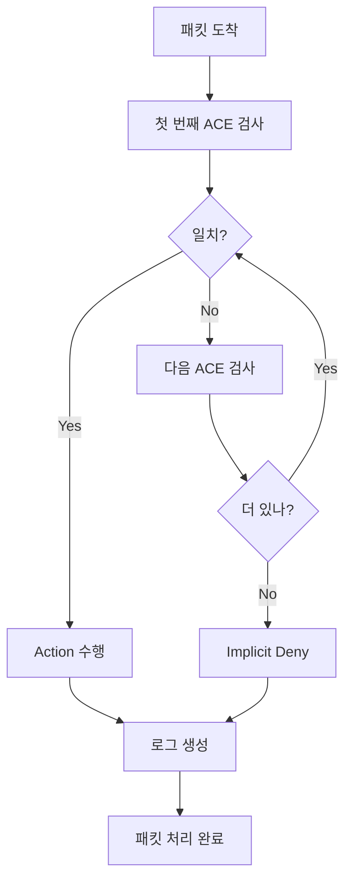

# ACL (Access Control Lists) - 상세 가이드

## 📝 개요
ACL(Access Control Lists)은 네트워크에서 트래픽을 제어하는 규칙의 순서화된 집합입니다. 라우터와 스위치에서 패킷을 허용하거나 거부하는 보안 메커니즘의 핵심입니다.

## 🎯 ACL의 목적과 용도

### 보안 기능
- **액세스 제어**: 특정 사용자/네트워크의 접근 차단
- **공격 방어**: DDoS, 스푸핑 등 공격 차단
- **내부 보안**: 내부 네트워크 간 트래픽 제어
- **감사 추적**: 트래픽 로깅 및 모니터링

### 관리 기능
- **대역폭 관리**: 특정 트래픽 제한
- **QoS 분류**: 트래픽 우선순위 결정
- **NAT 정의**: 주소 변환 범위 지정
- **VPN 트래픽**: 암호화할 트래픽 정의

## 🔧 ACL 동작 원리

### 기본 원칙
```
1. Top-down Processing: 위에서부터 순차적 검사
2. First Match Principle: 첫 번째 일치 시 적용
3. Implicit Deny All: 마지막에 암묵적 "deny any" 존재
4. Return Traffic: 상태 추적 없음 (별도 설정 필요)
```

### 처리 흐름


## 🎭 와일드카드 마스크 (Wildcard Mask)

### 개념과 특징
```
서브넷 마스크와 정반대:
- 0 비트: 반드시 일치해야 함 (care bit)
- 1 비트: 무시함 (don't care bit)

계산법: 와일드카드 = 255.255.255.255 - 서브넷마스크
```

### 주요 와일드카드 패턴
| 목적 | 주소/와일드카드 | 의미 |
|------|----------------|------|
| **특정 호스트** | 192.168.1.10 0.0.0.0 | host 192.168.1.10 |
| **전체 네트워크 /24** | 192.168.1.0 0.0.0.255 | 192.168.1.0/24 |
| **전체 네트워크 /16** | 192.168.0.0 0.0.255.255 | 192.168.0.0/16 |
| **모든 주소** | 0.0.0.0 255.255.255.255 | any |
| **홀수 호스트** | 192.168.1.1 0.0.0.254 | 마지막 옥텟 홀수 |
| **짝수 호스트** | 192.168.1.0 0.0.0.254 | 마지막 옥텟 짝수 |

### 계산 예시
```
네트워크: 192.168.10.0/26
서브넷 마스크: 255.255.255.192
와일드카드: 255.255.255.255 - 255.255.255.192 = 0.0.0.63

결과: 192.168.10.0 0.0.0.63
의미: 192.168.10.0 ~ 192.168.10.63 범위
```

## 📋 Standard ACL

### 특징 요약
- **번호 범위**: 1-99, 1300-1999
- **검사 항목**: 출발지 IP 주소만
- **배치 위치**: 목적지에 최대한 가까이
- **처리 오버헤드**: 낮음

### 설정 방법
```cisco
# 기본 문법
Router(config)# access-list number {permit|deny} source [wildcard]

# 구체적 예시
Router(config)# access-list 10 permit 192.168.1.0 0.0.0.255
Router(config)# access-list 10 deny 192.168.2.10 0.0.0.0
Router(config)# access-list 10 permit any

# 축약 표현
Router(config)# access-list 10 permit host 192.168.1.10
Router(config)# access-list 10 deny any
```

### 인터페이스 적용
```cisco
# 인바운드 적용
Router(config)# interface fastethernet 0/0
Router(config-if)# ip access-group 10 in

# 아웃바운드 적용  
Router(config-if)# ip access-group 10 out
```

## 📊 Extended ACL

### 특징 요약
- **번호 범위**: 100-199, 2000-2699
- **검사 항목**: 출발지, 목적지, 프로토콜, 포트
- **배치 위치**: 출발지에 최대한 가까이
- **처리 오버헤드**: 높음 (더 정밀한 제어)

### 기본 문법
```cisco
access-list number {permit|deny} protocol source source-wildcard 
         destination destination-wildcard [operator port]
```

### 프로토콜 지정
```cisco
# IP 전체
access-list 100 permit ip any any

# TCP 프로토콜
access-list 100 permit tcp 192.168.1.0 0.0.0.255 any eq 80

# UDP 프로토콜  
access-list 100 permit udp any host 192.168.2.10 eq 53

# ICMP 프로토콜
access-list 100 permit icmp any any echo-reply
```

### 포트 연산자
| 연산자 | 의미 | 예시 |
|--------|------|------|
| **eq** | 같음 | eq 80 (포트 80) |
| **neq** | 같지 않음 | neq 23 (텔넷 제외) |
| **lt** | 미만 | lt 1024 (well-known 포트) |
| **gt** | 초과 | gt 1023 (등록된 포트) |
| **range** | 범위 | range 20 21 (FTP) |

### 실무 예시
```cisco
# 웹 서버 보호 ACL
Router(config)# access-list 120 permit tcp any host 192.168.1.100 eq 80
Router(config)# access-list 120 permit tcp any host 192.168.1.100 eq 443
Router(config)# access-list 120 permit tcp any host 192.168.1.100 eq 22
Router(config)# access-list 120 deny tcp any host 192.168.1.100
Router(config)# access-list 120 permit ip any any

# 관리 네트워크만 SSH 허용
Router(config)# access-list 130 permit tcp 10.0.0.0 0.0.0.255 any eq 22
Router(config)# access-list 130 deny tcp any any eq 22
Router(config)# access-list 130 permit ip any any
```

## 🏷️ Named ACL

### 장점
- **의미 있는 이름**: 기능별 구분 쉬움
- **유연한 편집**: 라인 번호로 개별 수정
- **순서 제어**: 원하는 위치에 삽입
- **가독성 향상**: 유지보수 용이

### Standard Named ACL
```cisco
# 생성
Router(config)# ip access-list standard BRANCH_OFFICE
Router(config-std-nacl)# permit 192.168.10.0 0.0.0.255
Router(config-std-nacl)# permit 192.168.20.0 0.0.0.255
Router(config-std-nacl)# deny any

# 적용
Router(config)# interface serial 0/0/0
Router(config-if)# ip access-group BRANCH_OFFICE out
```

### Extended Named ACL
```cisco
# 생성
Router(config)# ip access-list extended INTERNET_ACCESS
Router(config-ext-nacl)# 10 permit tcp 192.168.1.0 0.0.0.255 any eq 80
Router(config-ext-nacl)# 20 permit tcp 192.168.1.0 0.0.0.255 any eq 443
Router(config-ext-nacl)# 30 permit udp 192.168.1.0 0.0.0.255 any eq 53
Router(config-ext-nacl)# 40 deny tcp any any eq 23
Router(config-ext-nacl)# 50 permit icmp any any
Router(config-ext-nacl)# 60 deny ip any any log

# 라인 편집
Router(config)# ip access-list extended INTERNET_ACCESS
Router(config-ext-nacl)# 25 permit tcp 192.168.1.0 0.0.0.255 any eq 25
Router(config-ext-nacl)# no 40  # 라인 40 삭제
```

## 📍 ACL 배치 원칙

### Standard ACL 배치
```
원칙: 목적지에 가까이 배치

이유:
- 출발지만 검사하므로 너무 일찍 차단하면 
  다른 목적지로의 정상 트래픽도 차단될 수 있음

     [PC1]───[R1]───[R2]───[Server]
                      ↑
                  여기에 적용 (목적지 근처)
```

### Extended ACL 배치
```
원칙: 출발지에 가까이 배치

이유:
- 정밀한 제어가 가능하므로 불필요한 트래픽을
  조기에 차단하여 대역폭 절약

[PC1]───[R1]───[R2]───[Server]
         ↑
    여기에 적용 (출발지 근처)
```

## 🔍 ACL 확인 및 모니터링

### 기본 확인 명령어
```cisco
# 모든 ACL 보기
Router# show access-lists

# 특정 ACL 보기
Router# show access-list 100
Router# show access-list INTERNET_ACCESS

# 인터페이스 적용 상태
Router# show ip interface fastethernet 0/0

# ACL 통계 (히트 카운트)
Router# show access-lists 100
```

### 출력 예시 해석
```
Router# show access-list 100
Extended IP access list 100
    10 permit tcp 192.168.1.0 0.0.0.255 any eq www (15 matches)
    20 permit tcp 192.168.1.0 0.0.0.255 any eq 443 (8 matches)  
    30 deny tcp any any eq telnet (2 matches)
    40 permit ip any any (1453 matches)
```

## 🐛 문제해결 및 디버깅

### 일반적인 문제들

#### 1. 의도치 않은 트래픽 차단
```
문제: 정상 트래픽이 차단됨
원인: 
- 잘못된 ACL 순서
- 와일드카드 마스크 오류
- implicit deny

해결:
1. ACL 순서 점검
2. 로그 확인
3. 테스트용 permit any 임시 추가
```

#### 2. 리턴 트래픽 문제
```
문제: 응답 패킷이 돌아오지 않음
원인: ACL이 단방향성이므로 리턴 트래픽 고려 안함

해결:
1. 양방향 ACL 설정
2. Established 연결 허용
3. 상태 추적 기능 사용 고려
```

#### 3. 성능 저하
```
문제: ACL 적용 후 성능 저하
원인: 
- 복잡한 Extended ACL
- 너무 많은 ACE
- 비효율적인 순서

해결:
1. 자주 매치되는 규칙을 위쪽에 배치
2. 불필요한 규칙 제거
3. 하드웨어 가속 기능 활용
```

### 디버깅 명령어
```cisco
# ACL 로깅 활성화
Router(config)# access-list 100 deny ip any any log

# 상세 로깅
Router(config)# access-list 100 deny ip any any log-input

# 로그 확인
Router# show logging

# 실시간 로그 모니터링
Router# terminal monitor
Router# debug ip packet 100  # ACL 100에 대해서만
```

## 🚀 고급 ACL 기능

### Time-based ACL
```cisco
# 시간 범위 정의
Router(config)# time-range BUSINESS_HOURS
Router(config-time-range)# periodic weekdays 09:00 to 18:00

# ACL에 적용
Router(config)# ip access-list extended TIME_POLICY
Router(config-ext-nacl)# permit tcp any any eq 80 time-range BUSINESS_HOURS
Router(config-ext-nacl)# deny tcp any any eq 80
```

### Reflexive ACL (상태 추적)
```cisco
# 내부에서 외부로의 트래픽 허용
Router(config)# ip access-list extended OUTBOUND
Router(config-ext-nacl)# permit tcp 192.168.1.0 0.0.0.255 any reflect TCP_TRAFFIC

# 외부에서 내부로는 설정된 세션만 허용
Router(config)# ip access-list extended INBOUND  
Router(config-ext-nacl)# evaluate TCP_TRAFFIC
Router(config-ext-nacl)# deny ip any any

# 인터페이스 적용
Router(config)# interface fastethernet 0/0
Router(config-if)# ip access-group OUTBOUND out
Router(config-if)# ip access-group INBOUND in
```

### Dynamic ACL (Lock-and-Key)
```cisco
# 동적 ACL 템플릿
Router(config)# access-list 101 dynamic TEMP_ACCESS timeout 10 permit ip any any

# 사용자 인증 후 동적 ACL 활성화
Router(config)# username admin password secret123
Router(config)# line vty 0 4
Router(config-line)# login local
Router(config-line)# autocommand access-enable host timeout 5
```

## 🛡️ 보안 모범 사례

### ACL 설계 원칙
```
1. Principle of Least Privilege
   - 필요한 최소한의 권한만 부여
   - 기본적으로 모든 것을 차단하고 필요한 것만 허용

2. Defense in Depth
   - 다계층 보안 적용
   - 방화벽 + ACL + 기타 보안 기능 조합

3. Regular Review
   - 정기적인 ACL 검토 및 업데이트
   - 불필요한 규칙 제거
   - 로그 분석을 통한 최적화
```

### 실무 체크리스트
```
설정 전:
□ 트래픽 플로우 분석 완료
□ 필요한 서비스/포트 목록 작성
□ 배치 위치 결정
□ 테스트 계획 수립

설정 후:
□ 정상 트래픽 테스트
□ 차단 트래픽 테스트  
□ 로그 모니터링 설정
□ 문서화 완료
□ 백업 및 복구 계획
```

## 📚 실무 시나리오

### 시나리오 1: 지사 사무실 보안
```
요구사항:
- 내부 사용자는 인터넷 접근 허용 (HTTP/HTTPS만)
- 외부에서 내부 네트워크 접근 차단
- 관리자만 SSH 접근 허용

설정:
Router(config)# ip access-list extended BRANCH_SECURITY
Router(config-ext-nacl)# permit tcp 192.168.1.0 0.0.0.255 any eq 80
Router(config-ext-nacl)# permit tcp 192.168.1.0 0.0.0.255 any eq 443
Router(config-ext-nacl)# permit tcp host 10.0.0.100 192.168.1.0 0.0.0.255 eq 22
Router(config-ext-nacl)# permit udp 192.168.1.0 0.0.0.255 any eq 53
Router(config-ext-nacl)# deny ip any 192.168.1.0 0.0.0.255
Router(config-ext-nacl)# permit ip any any
```

### 시나리오 2: DMZ 서버 보호
```
요구사항:
- 웹 서버는 HTTP/HTTPS만 허용
- 메일 서버는 SMTP/POP3/IMAP 허용
- 내부에서만 SSH 관리 허용

설정:
Router(config)# ip access-list extended DMZ_PROTECTION
Router(config-ext-nacl)# permit tcp any host 203.0.113.10 eq 80
Router(config-ext-nacl)# permit tcp any host 203.0.113.10 eq 443
Router(config-ext-nacl)# permit tcp any host 203.0.113.20 eq 25
Router(config-ext-nacl)# permit tcp any host 203.0.113.20 eq 110
Router(config-ext-nacl)# permit tcp any host 203.0.113.20 eq 143
Router(config-ext-nacl)# permit tcp 192.168.0.0 0.0.255.255 203.0.113.0 0.0.0.255 eq 22
Router(config-ext-nacl)# deny ip any 203.0.113.0 0.0.0.255
```

## 🔗 관련 주제
- [[NAT-PAT|NAT/PAT]] - ACL과 주소 변환
- [[포트 보안|포트 보안]] - Layer 2 보안
- [[방화벽|방화벽]] - 상태 추적 보안
- [[라우팅 기초|라우팅]] - 패킷 포워딩과 ACL

## 🏷️ 태그
#ccna #acl #네트워크보안 #트래픽제어 #접근제어 #보안정책 #패킷필터링